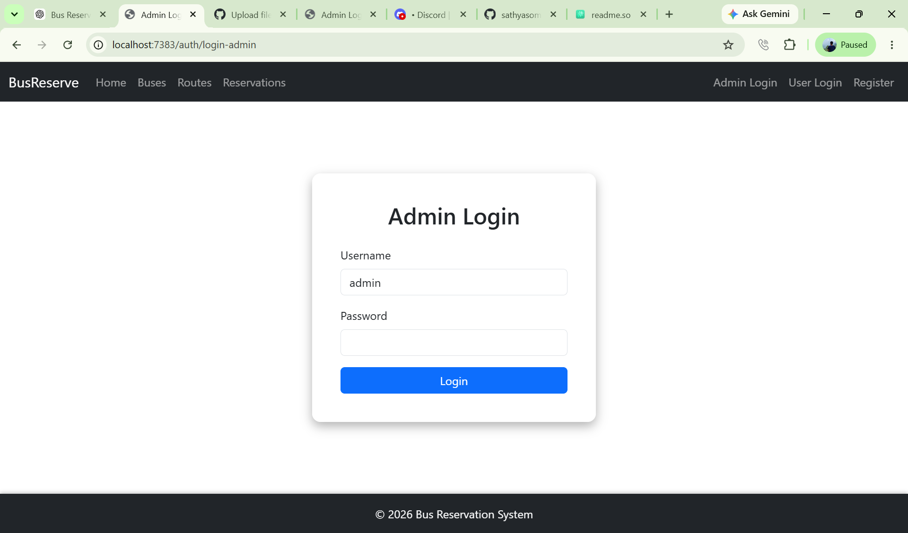
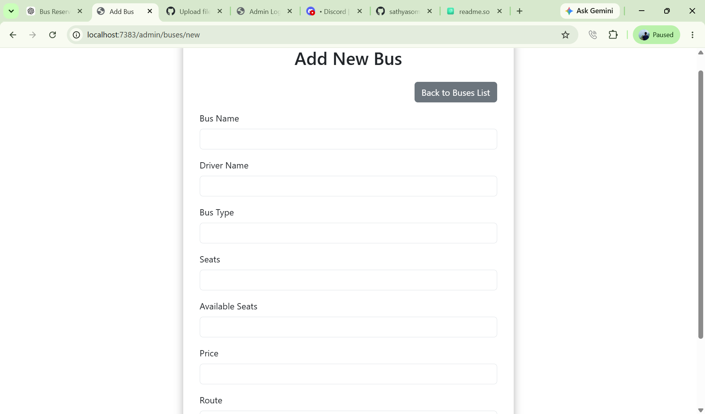
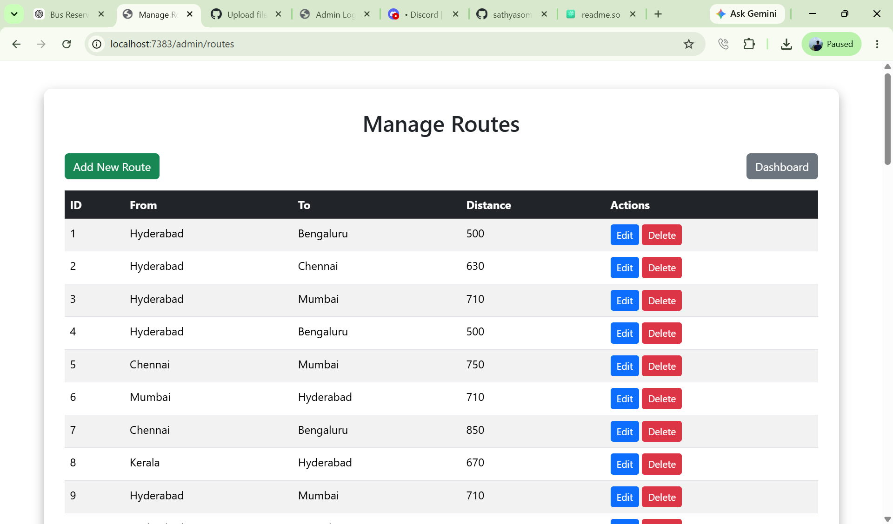
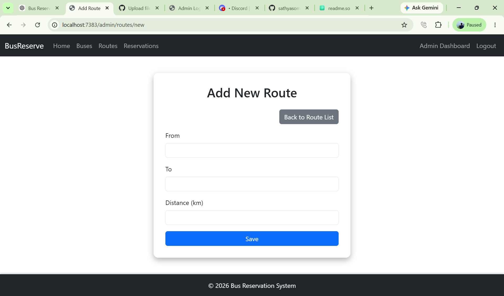
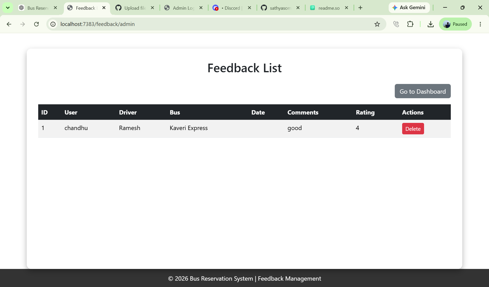
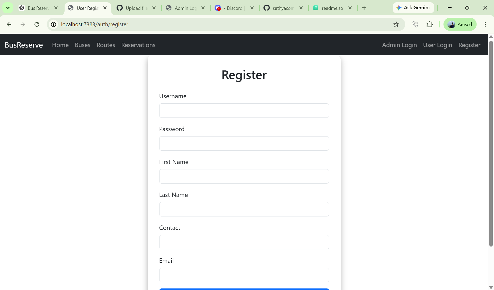
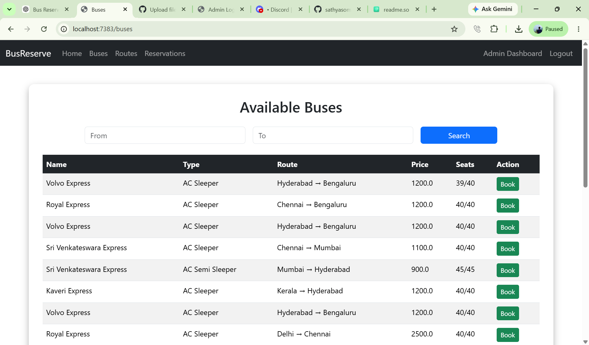
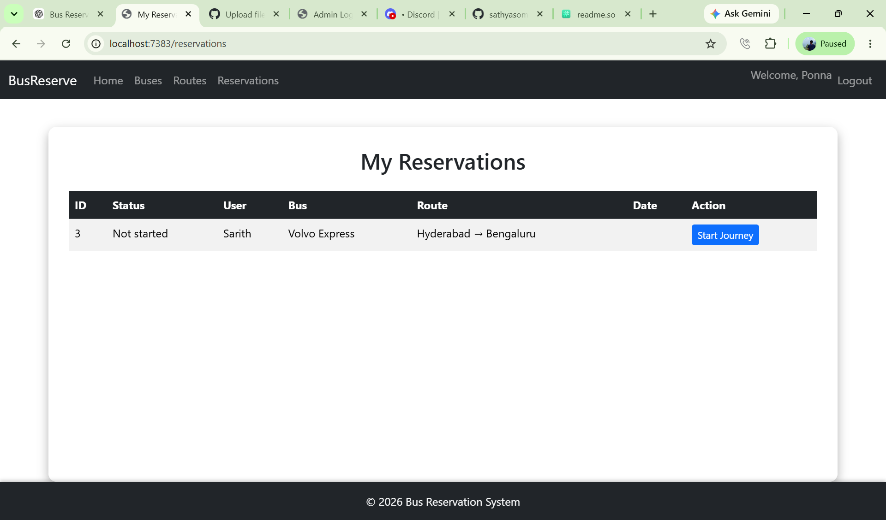
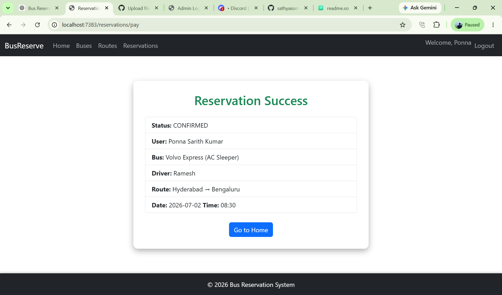

# 🚌 Bus Reservation System

A full-stack Bus Reservation System developed using Spring Boot, Spring MVC, JSP, MySQL and Bootstrap.

## Features

- User Registration & Login
- Admin Login
- Search Buses
- Book Tickets
- Payment Simulation
- Reservation Management
- Feedback Module
- Bus Management
- Route Management
- Admin Dashboard

## Tech Stack

- Java
- Spring Boot
- Spring MVC
- Spring Data JPA
- JSP
- MySQL
- Bootstrap
- Maven

## Project Architecture

User
↓
Controller
↓
Service
↓
Repository (JPA)
↓
MySQL

## Screenshots

### Home Page


### 🔐 Admin Login


### 📊 Admin Dashboard


### 🚌 Manage Buses


### ➕ Add Bus


### 🛣️ Manage Routes


### ➕ Add Route


### 💬 Feedback Management


### 👤 User Registration


### 🔍 Available Buses


### 🎫 Reservation Form


### 💳 Payment Page


### ✅ Reservation Success


### 📋 My Reservations


## Installation

```bash
git clone https://github.com/Sarith-Kumar/BusReservationSystem.git
```

Create MySQL database

```
busreservation
```

Update

```
application.properties
```

Run

```
mvn spring-boot:run
```

## Future Improvements

- Online Payment Gateway
- Email Notifications
- QR Ticket
- Seat Selection
- JWT Authentication
- REST APIs
